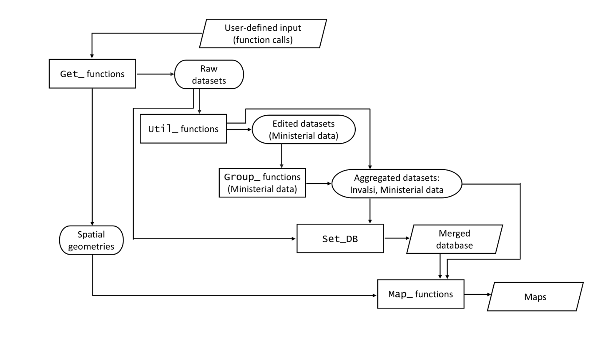

```{r setup, include=FALSE, message = FALSE, warning = FALSE}

knitr::opts_chunk$set(echo = TRUE)
library(htmltools)
tags$head(
  tags$link(
    href = "https://fonts.googleapis.com/css2?family=Poppins:wght@400;700&display=swap",
    rel = "stylesheet"
  )
)

```

```{r input, echo = FALSE, message = FALSE, warning = FALSE}

library(SchoolDataIT)
library(magrittr)
library(INLA)
#  #  #  # font-weight: inherit;
#Mun22_shp <- Get_Shapefile(2022, level = "LAU")
#Prov22_shp <- Get_Shapefile(2022, level = "NUTS-3")
#Registry23 <- Get_Registry(2023)
#AdmUnNames <- Get_AdmUnNames(Year = 2022, date = "06_30")
#School2mun23 <- Get_School2mun(2023, input_Registry = Registry23, input_AdmUnNames = AdmUnNames)
#InnerAreas <- Get_InnerAreas()
files <- list.files("R objects", full.names = T)
for (file in files) load(file)
```


 
## The `SchoolDataIT R` package


- **SchoolDataIT** is an **R** package to **Retrieve**, **Harmonise** and **Map** Open Data regarding the Italian **Education** System 

- **Compiles** and **displays** the available data sets about Italian school system, with a focus on the **infrastructural features**

- **Scope** of this line of research:
  - Encourage **Multidimensional** analysis of the state of the school system
  - Take into account **spatial information** in this analysis

<!-- Change the hyperref!!!!!!!!!!!!!!!!!!!!!!!!! -->  
- <a href="https://lcef97.github.io/ICSA25/#1" target="_blank">HTML version</a>


 
## Context: the AMELIA platform


- The present `R` package is meant as a contribution to the <a href = "https://grins.it/progetto/piattaforma-amelia" target = "_blank"> **AMELIA** </a> **data platform**, managed by the **GRINS** foundation

- **Data platform** for the transfer of knowledge and statistical analysis
  - Broad **repository** hosting several categories of **administrative** data from **different sources**
  - Available to either **private**, **corporate** or **academic** users
  - Data organised at the **territorial level** of municipalities (**LAU**)

## The importance of school infrastructure for learning processes


- Drawing increasing interest in **scientific literature**

- Foundational work in the **international** context: systematic review by **World Bank** (2019)
  - Comparison across several countries, both OECD and developing countries
  - Material factors account for a symbolic "third teacher"


<div class = "footnote">
  Barrett, P., Treves, A., Shmis, T., Ambasz, D. (2019). *The impact of school infrastructure on learning: A synthesis of the evidence.* International Development in Focus;.  Washington, DC: World Bank. 
</div>


## The importance of school infrastructure for learning processes


- Foundational work in the **Italian** context: working paper by **Bank of Italy** (2023)
  - Follows a **multidimensional** analysis
  - Detailed comparison of infrastructure endowment at the **regional** level &rarr; **Northern** regions are typically **advantaged** under many dimensions
  - Managing territorial gaps is a **complex task** for policymakers due to the **allocation of competences** between State and local authorities
  
  <div class = "footnote">
   Bucci, M., Gazzano, L., Gennari, E., Grompone, A., Ivaldi, G., Messina, G.,  Ziglio, G. (2023). *Per chi suona la campan(ell)a? La dotazione di infrastrutture scolastiche in Italia (For whom the bell tolls? The availability of school infrastructure in Italy).* Politica economica, 1-50.

</div>

## The importance of school infrastructure for learning processes


- **School infrastructure** influences **learning processes** through several dimensions:

  - School **accessibility**: availability of transport, schools size
  - Indoor **safety**: enhances learning continuity
  - Outdoor **safety**, from hazards like pollution of earthquakes
  - Availability of **Learning** spaces (IT rooms, laboratories)
  - Availability of **Recreational** spaces (e.g. canteens allow for **full-time** schooling)


## The `SchoolDataIT R` package


- The **`SchoolDataIT`** `R` package has been developed in the spirit of the aforementioned line of research

- Data gathered from different **open institutional sources**

- **Aim**: detecting areas of **educational vulnerability** &rarr; planning of appropriate **development policies**

- Package relies on the `tidyverse` environment &rarr; output datasets **easily exported**

- version <a href="https://cran.r-project.org/web/packages/SchoolDataIT/index.html" target="_blank"> 0.2.2 </a> on CRAN (now compiling version 0.2.3) 

- Constant **maintenance** <a href="https://github.com/lcef97/SchoolDataIT/tree/main" target="_blank"> on Github </a> (version 0.2.4, to be submitted to CRAN)

  

## The `SchoolDataIT R` package


```{r flowchart, echo = F}
package.scheme.1 <- function(width = 900) {
  return(DiagrammeR::grViz("digraph {
    graph [layout = dot, splines = ortho, rankdir = TB, nodesep = 1.5, overlap = false, fontname = 'Poppins']

    node [shape = parallelogram, style = filled, fillcolor = \"#004E5A60\", fontcolor = black, fontname = 'Poppins', color = \"#004E5A\", fontsize = 22 ]
    zero[label = 'User-defined input']
    end1[label = 'Merged database']
    end2[label = 'Maps']

    node [shape = rectangle, style = filled, fillcolor = \"#004E5A60\", fontcolor = black, fontname = 'Poppins', color = \"#004E5A\", fontsize = 22, width = 3.4]
    F1[label = 'Get_ functions']
    F2[label = 'Util_ functions']
    F3[label = 'Group_ functions']
    F4[label = 'Set_DB']
    F5[label = 'Map_ functions']

    node [shape = oval, style = filled, fillcolor = \"#004E5A60\", fontcolor = black, fontname = 'Poppins', color = \"#004E5A\", fontsize = 22, width = 3.4]
    O1[label = 'Raw datasets']
    O2[label = 'Spatial\ngeometries']
    O3[label = 'Edited datasets']
    O4[label = 'Aggregated datasets']

    # Invisible helper nodes for spacing
    node [shape = point, width = 0, height = 0, label = '']
    spacer2
    spacer1

    # Align nodes into ranks
    {rank = same; F1; O1}
    {rank = same; spacer1; F2}
    {rank = same; F3; spacer2; O4}
    {rank = same; F4; end1}

    # Edges and directions
    zero -> F1 [dir = forward]
    F1 -> O1  
    F1 -> O2  
    O1 -> spacer1 [dir = none]   
    spacer1 -> F2
    O1 -> F4 [style = dashed]
    O2 -> F5 [dir = forward]
    F2 -> O3  
    #F2 -> spacer2 [style = invisible]   
    F2 -> O4 
    O3 -> F3 [direction = forward]
    F3 -> O4 [dir = forward]
    O4 -> F4 [dir = forward]
    O4 -> F5 [dir = forward, style = dashed]
    F4 -> end1 [dir = forward]
    end1 -> F5 [dir = forward]
    F5 -> end2 [dir = forward]

  }", width = width))
}

package.scheme.1()
```
  
<!--

-->


## Main function modules


- **`Get_`**: input **scraping**. Information is not altered and the user receives a data set as close as possible as the provider releases it

- **`Util_`**: auxiliary functions; mainly data **manipulation** or quality checks

- **`Group_`**: data **aggregation** at the relevant territorial level
  - **NUTS-3/Province**
  - **LAU/Municipality**

- **`Map_`**: displaying
  - **Static** maps (vector format): easy to **export**
  - **Interactive** maps: preserve more **information** 


## Main datasets


- Data from the **Ministry of Education** (school level)
  - National **Schools Registry**
  - **School Buildings** database
  - **Students** and **teachers** counts
  
<div class = "footnote" >
Source: <https://dati.istruzione.it/opendata/opendata/>
</div>


- **Ultra - Broadband** implementation (school level)

<div class = "footnote" >
Source: <https://bandaultralarga.italia.it/scuole-voucher/dashboard-scuole/>
</div>


- **Invalsi** census survey (NUTS-3 and LAU level)

<div class = "footnote" >
Source: <https://serviziostatistico.invalsi.it/en/archivio-dati/?_sft_invalsi_ss_data_collective=open-data>
</div>


## School buildings database


- Main source of information on **school infrastructure**

- Regards several dimensions, such as:
  - **Environmental** context, environmental/administrative **restrictions**, acoustic insulation
  - **Accessibility** through private or public transport
  - School area **surface**, building **volume**,  **age/period**
  - Intended use of **learning** and **recreational spaces**
  - Heating systems and energy saving device
  - Overcoming **architectural barriers**
  - **Seismic risk** and **seismic design**
```{r DB23_MIUR, echo = FALSE, message = FALSE}
DB23_MIUR <- Group_DB_MIUR(input_DB23_MIUR, input_InnerAreas = InnerAreas, ord_InnerAreas = T, verbose = FALSE)

```

<!-- - Example: proportion of **middle schools** served by **urban public transport**: -->

```{r transport map, echo = FALSE, message = FALSE,  fig.height = 3.3}
#DB23_MIUR %>%  Map_School_Buildings(
#  input_shp = Prov22_shp, field = "Urban_public_transport", 
#  level = "NUTS-3", order = "Middle",
#  verbose = F)


```
## School buildings database


- Example: synthetic indicator of **public transport** availability &larr; **Sensitivity**-based weights$^1$ (using R package <a href = "https://cran.r-project.org/web/packages/compindexR/index.html">`CompindexR`</a>)


```{r transport idx map, echo = FALSE, message = FALSE, warning = FALSE, fig.height = 3}

tpt_indicator <- DB23_MIUR$Province_data %>% dplyr::select(.data$Urban_public_transport,
                                          .data$Interurban_public_transport,
                                          .data$Railway_transport,
                                          .data$School_bus) %>% 
  compindexR::calc_compindex()

DB23_MIUR$Province_data %>% 
  dplyr::mutate(Public_transport_idx = tpt_indicator$ci$ci) %>% 
  Map_School_Buildings(
  input_shp = Prov22_shp, field = "Public_transport_idx", 
  level = "NUTS-3", order = "Middle",
  verbose = F)

```
<div class = "footnote" >
$^1$ 0.254 **Urban** transport + 0.158  **Interurban** transport + 0.328 **railway** transport + 0.260 School **buses**
</div>
## School buildings database


- Example: proportion of **primary** schools provided with a **school restaurant**
```{r canteem map, echo = FALSE, message = FALSE,  fig.height = 3.3}
DB23_MIUR %>%  Map_School_Buildings(
  input_shp = Prov22_shp, field = "Canteen", 
  level = "NUTS-3", order = "Primary",
  verbose = F)
```


 


## Students counts and class size


- Proportion of **primary** schools allowing for **full-time** schooling

```{r nstud, echo = FALSE, message = FALSE, warning = FALSE}
nstud23 <- Group_nstud(input_nstud23,
                       input_Registry = Registry23,
                       input_School2mun = School2mun23,
                       input_InnerAreas = InnerAreas,
                       Year = 2023,
                       InnerAreas = TRUE,
                       ord_InnerAreas = TRUE,
                       verbose = FALSE)


nstud23_rt_grouped <- Group_nstud(nstud23_rt,
                       input_Registry = Registry23,
                       input_School2mun = School2mun23,
                       input_InnerAreas = InnerAreas,
                       Year = 2023,
                       InnerAreas = TRUE,
                       ord_InnerAreas = TRUE,
                       verbose = FALSE)

nstud23_rt_primary_prov <- nstud23_rt_grouped$Province_data %>%
  dplyr::filter(.data$Order == "Primary") %>% 
  dplyr::mutate(FT_per_school = .data$Tot_Students_full_time/.data$Tot_Students)


```


```{r fulltime map, echo = FALSE, message = FALSE, warning = FALSE, fig.height = 3.3}
Map_DB(nstud23_rt_primary_prov, 
       order = "Primary", level = "NUTS-3",
       input_shp = Prov22_shp,
       field = "FT_per_school", 
       main = "Full-time schooling",
       verbose = F)

```

## Usage example: classroom size and Invalsi scores


- Suppose we are interested in studying the link between **class size** and **students outcome in Mathematics**

  - Tipically **negative** association in literature

- Scope: **last** year of **middle** school, year **2022/23**  

- Students outcome measured by **Invalsi scores** (spatially homogeneous indicator, high-quality datum)

  - Mean = $200$ points; between-students s.d. = $40$ points
  - Available for $\approx 2000$ municipalities (data downloaded in December 2024)

```{r DB23 try, echo = FALSE, message = FALSE, warning = FALSE}
DB23 <- Set_DB(Year = 2023,
               ord_InnerAreas = TRUE,
               BroadBand = F,
               nteachers = F,
               input_Registry = Registry23,
               input_SchoolBuildings = input_DB23_MIUR,
               input_School2mun = School2mun23,
               input_Invalsi_IS = Invalsi_IS,
               input_AdmUnNames = AdmUnNames20220901,
               input_nstud = input_nstud23,
               NA_autoRM = T, verbose = F)

DB23_mid <- DB23 %>%
  dplyr::filter(.data$Order == "Middle") %>%
  dplyr::select_if(!grepl("_\\d+", names(.)) |
                     grepl("_8$|_08$", names(.))) %>%
  dplyr::mutate(Central = .data$A_mun + .data$B_mun) %>%
  dplyr::mutate(Peripheral = .data$E_mun + .data$F_mun) %>%
  dplyr::mutate(nstud_8_std =
                  as.vector(scale(.data$Students_per_class_8))) %>%
  dplyr::filter(!is.na(.data$M_Italian_8))

DB23_mid_ctr <- Mun22_ctr %>% dplyr::transmute(Municipality_code = .data$PRO_COM_T) %>%
  dplyr::left_join(DB23_mid) %>%
  dplyr::filter(!is.na(.data$Province_code))

DB23_mid_ctr$lat <- scale(sf::st_coordinates(DB23_mid_ctr))[,2]
DB23_mid_ctr$long <- scale(sf::st_coordinates(DB23_mid_ctr))[,1]


```


```{r mesh, include = FALSE}
coords <- sf::st_coordinates(DB23_mid_ctr)
distances <- sf::st_distance(DB23_mid_ctr, DB23_mid_ctr)
mesh <- inla.mesh.2d(loc = coords,
                     max.edge = c(max(distances)/5, max(distances)/2))
spde <- inla.spde2.pcmatern(mesh = mesh, alpha = 2,
                            prior.range = c(3.5e+5, 0.95),
                            prior.sigma = c(2.5, 0.95))
A.mat <- inla.spde.make.A(mesh=mesh, loc= coords)
idx <- inla.spde.make.index(name = "idx", n.spde = spde$n.spde)


DB23_mid_stack <- inla.stack(
  data = list(M_Mathematics_8 = DB23_mid_ctr$M_Mathematics_8,
              M_Italian_8 = DB23_mid_ctr$M_Italian_8),
  A = list(A.mat, 1),
  effects = list(c(idx), list(
    Intercept = rep(1, nrow(DB23_mid_ctr)),
    nstud_8_std = DB23_mid_ctr$nstud_8_std,
    Inner_area = DB23_mid_ctr$Inner_area,
    lat = DB23_mid_ctr$lat,
    long = DB23_mid_ctr$long)))

```


```{r INLA, echo = FALSE, message = FALSE}
m8_spde <- inla(
  M_Mathematics_8 ~ -1 + Intercept +
    nstud_8_std + Inner_area + lat + long +
    f(idx, model = spde),
  data = inla.stack.data(DB23_mid_stack, spde = spde),
  family = "gaussian",
  control.fixed = list(prec = 0),
  control.predictor = list(A = inla.stack.A(DB23_mid_stack)),
  # Commands to make code reproducible
  control.compute = list(internal.opt = FALSE),
  num.threads = 1, verbose = T)


m8_spde_res <- inla.spde2.result(m8_spde, name = "idx", spde = spde)

spde_summary.hyperpar <- t(data.frame(
  #Error_var = unlist(inla.zmarginal(inla.tmarginal(function(x) 1/x,
   #              m8_spde$marginals.hyperpar[[1]]), silent = T)),
  variance = unlist(inla.zmarginal(
    m8_spde_res$marginals.variance.nominal[[1]], silent = T)),
  range = unlist(inla.zmarginal(
    m8_spde_res$marginals.range.nominal[[1]], silent = T)))[-c(4,6),]) 
spde_summary.hyperpar[1, ]<- round(spde_summary.hyperpar[1, ], 3)
spde_summary.hyperpar[2, ]<- round(spde_summary.hyperpar[2, ], 0)


```


## Usage example: OLS regression


- Simplest analysis: **OLS** regression of municipality-level **Invalsi scores** on municipality-level average **classroom size** 

$$
y = \beta_0 +  \beta_\mathrm{nstud} X_\mathrm{nstud} + \varepsilon
$$

<p style="font-size: 18px">
$y$: Invalsi score; $X_\mathrm{nstud}$: classroom size; $\beta$: regression coefficients; $\varepsilon$: Gaussian error
</p>

&rarr; Puzzling result: **positive** association ($3.236$ Invalsi points)
&rarr; Does classroom size incorporate **additional information** we are overlooking? 

  - example: **demographic** dynamics: classrooms are more crowded in **infrastructural poles** than in **peripheral areas**

## Usage example: OLS regression


```{r ols res, echo = FALSE}
ols8_0 <- lm(M_Mathematics_8 ~ 1 + nstud_8_std, data = DB23_mid_ctr)
summary(ols8_0)$coefficients[,c(1,2)] %>% round(3) %>% 
  DT::datatable( )    # options = list(pageLength = 5)
```


## Distribution of classroom size


- Distribution across the $6$ classes of the inner areas taxonomy (**A**, **B**: pole; **C**: belt; **D**: intermediate; **E**: peripheral; **F**: ultra-peripheral) 


```{r nstud boxplot, message = FALSE, warning=FALSE, echo = FALSE, fig.height = 3.3}
nstud23$Municipality_data  %>% dplyr::filter(.data$Order == "Middle") %>%
  dplyr::mutate(idx = as.numeric(as.factor(.data$Municipality_code))) %>%
  dplyr::mutate(Inner_area = dplyr::case_when(
    .data$A_mun == 1 ~ "A",
    .data$B_mun == 1 ~ "B",
    .data$C_mun == 1 ~ "C",
    .data$D_mun == 1 ~ "D",
    .data$E_mun == 1 ~ "E",
    .data$F_mun == 1 ~ "F",
  )) %>%
  dplyr::filter(!is.na(.data$Inner_area)) %>%
  dplyr::left_join(dplyr::select(SchoolDataIT:::prov.names(), c(1,2)), by = "Province_code") %>%
  dplyr::mutate(Macroregion = dplyr::case_when(
    .data$Region_code %in% c(1:8) ~ "1_North",
    .data$Region_code %in% c(9:12) ~ "2_Center",
    .data$Region_code %in% c(13:20) ~ "3_South")) %>%
  ggplot2::ggplot(ggplot2::aes(.data$Inner_area, .data$Students_per_class_8))+
  ggplot2::geom_boxplot() + ggplot2::facet_wrap(ggplot2::vars(.data$Macroregion)) +
  ggplot2::labs(x = "Inner areas taxonomy", y = "Class size by municipality") +
  ggplot2::ggtitle("Average class size for school grade 8") +
  ggplot2::theme(axis.title.x = ggplot2::element_text(size = 14),
                 axis.title.y = ggplot2::element_text(size = 14),
                 title = ggplot2::element_text(size = 12))


```


## Usage example: spatial model


- Take into account **additional information**
  - Spatial **location** of municipalities
  - **Inner areas** taxonomy (central/peripheral)
 - Model:
 $$
 y = \beta_0 + X_\mathrm{nstud} \beta_\mathrm{nstud} + X_{I}\beta_{I} + \beta_{\ell} \ell +\beta_{\phi} \phi +u + \varepsilon
 $$
   - <p style = "font-size: 18px">
   $X_{\mathrm{nstud}}$: average classroom size; $X_I$: dummy for inner areas taxonomy (1: inner area, 0: central area), $\ell$: longitude, $\phi$: latitude; 
   $u$: latent **spatially-structured** Gaussian process
   </p>

## Usage example: spatial model


- $u$ defined over a **continuous spatial domain** with prior distribution: $u \sim N(0, \Sigma)$ &rarr; $\Sigma$: Matérn correlation matrix 

<div class = "footnote"> see:  Banerjee, S., Carlin, B.P., Gelfand, A.E. (2014). *Hierarchical Modeling and Analysis for Spatial Data*, 2nd edition, Chapman and Hall/CRC </div>
  
  
- $u$ is approximated with a **Gaussian Markov Random Field** defined on a **2-d manifold** 

<div class = "footnote">
Lindgren, F., Rue, H., Lindström, J. (2011). *An Explicit Link between Gaussian Fields and Gaussian Markov Random Fields: The Stochastic Partial Differential Equation Approach*, JRSS B, 73(4), pp 423–498 </div>


- Model estimated using the **Integrated Nested Laplace Approximation** (**INLA**) 


<div class = "footnote">
Rue, H., Martino, S., & Chopin, N. (2009). *Approximate Bayesian inference for latent Gaussian models by using integrated nested Laplace approximations*. JRSS B, 71(2), 319-392. </div>


## Usage example: spatial model


- Full model specification
  - $\beta$ terms have **flat** priors
  - $\varepsilon \sim N(0, \sigma_{\varepsilon}^2)$, where $\sigma_{\varepsilon}^{-2} \sim \mathrm{Gamma}(1, 5 \cdot 10^{-5})$
  - $\Sigma$ has variance and range parameters $\sigma^2$ and $r$, both of which are assigned a **penalised compexity** prior, where $r_0 = 350 \mathrm{km}$ and $\sigma_0 = 2.5$: 
$$
\left \{ \begin{array}{ll}
prob \left( r < r_0 \right) = 0.95 \\
prob \left( \sigma > \sigma_0 \right) = 0.95
\end{array} \right.
$$


## Spatial regression model results

```{r m8_spde summary fixed, echo = FALSE}
DT::datatable(round(m8_spde$summary.fixed[,c(1,2,3,5)], 3), 
              options = list(pageLength = 5)) #%>% DT::formatRound(columns = "Status", digits = 4)

```
  - Classroom size has **not** a significant effect anymore
  - **Significant** disadvantage of **inner areas**
  - Strong **North-South** trend


## Spatial regression model results


```{r trends, warning = FALSE, echo = FALSE, message = FALSE, fig.cap = "Estimated linear trend (left) and latent spatial field (right)"}
x_range <- range(coords[, 1])
y_range <- range(coords[, 2])
grid <- expand.grid(
  x = seq(x_range[1], x_range[2], length.out = 400),
  y = seq(y_range[1], y_range[2], length.out = 400)
)

A_grid <- inla.spde.make.A(mesh = mesh, loc = as.matrix(grid))

grid_sf <- data.frame(
  x = grid$x, y = grid$y,
  GF = as.vector(A_grid %*% m8_spde$summary.random$idx$mean),
  trend = as.vector(scale(grid) %*%
                      m8_spde$summary.fixed$mean[c(5,4)])) %>%
  sf::st_as_sf(coords = c("x", "y"), crs = 32632)

intersected_sf <- sf::st_intersection(grid_sf, Prov22_shp)
intersected_sf$x <- sf::st_coordinates(intersected_sf)[,1]
intersected_sf$y <- sf::st_coordinates(intersected_sf)[,2]

ggleft <- ggplot2::ggplot(intersected_sf, ggplot2::aes(x = x, y = y, fill = .data$trend)) +
  ggplot2::geom_tile() +
  ggplot2::scale_fill_viridis_c()+
  ggplot2::ggtitle("Expected linear trend")+
  ggplot2::theme(
    axis.text.x = ggplot2::element_blank(),
    axis.text.y = ggplot2::element_blank(),
    panel.background = ggplot2::element_rect(fill = "white", color = NA),
    panel.border = ggplot2::element_rect(color = "black", fill = NA),
    panel.grid.major = ggplot2::element_line(color = "grey80"),
    panel.grid.minor = ggplot2::element_line(color = "grey80"),
  )

ggright <- ggplot2::ggplot(intersected_sf, ggplot2::aes(x = x, y = y, fill = .data$GF)) +
  ggplot2::geom_tile() +
  ggplot2::scale_fill_viridis_c()+
  ggplot2::ggtitle("Expected Gaussian field")+
  ggplot2::theme(
    axis.text.x = ggplot2::element_blank(),
    axis.text.y = ggplot2::element_blank(),
    panel.background = ggplot2::element_rect(fill = "white", color = NA),
    panel.border = ggplot2::element_rect(color = "black", fill = NA),
    panel.grid.major = ggplot2::element_line(color = "grey80"),
    panel.grid.minor = ggplot2::element_line(color = "grey80"),
  )

gridExtra::grid.arrange(ggleft, ggright, nrow = 1)
```


## Interpreting the spatial effect


- **North-South** and **pole/periphery** differences already kept into account 

- **Hyperparameters** &rarr; median $\sigma^2$ (**marginal variance** of $u$) about $31$ points; median **range** about $84.7$ km

```{r hyperpar, echo = FALSE}
DT::datatable(spde_summary.hyperpar, 
              options = list(pageLength = 5))
```


## Interpreting the spatial effect


- **Darkest** regions: education **vulnerability** not captured by covariates
  - Po Delta; Gargano peninsula; Naples hinterland; upper Ionian Calabria; Northwestern Sardinia

- **Brightest** regions: relatively **advantaged** territories
  - Inland Sicily; Central Italy inland; Salento peninsula

&rarr; What does this example tell us? 

- Assessing the impact of **class size** on student outcomes is less simple than it seems &rarr; **Auxiliary** information such as the **degree of centrality** of municipalities or **geographical information** becomes crucial<a href="https://arxiv.org/pdf/2412.17710" target="_blank">.</a>

 


# \n
 
<div class="final-slide"> 
</div>
